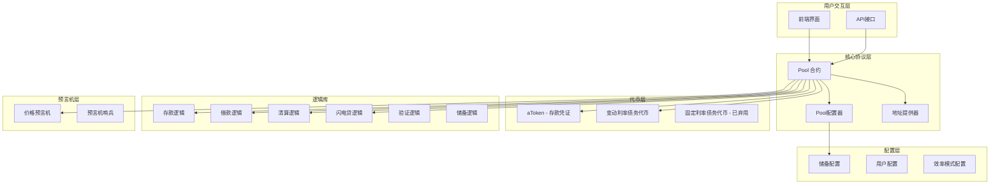
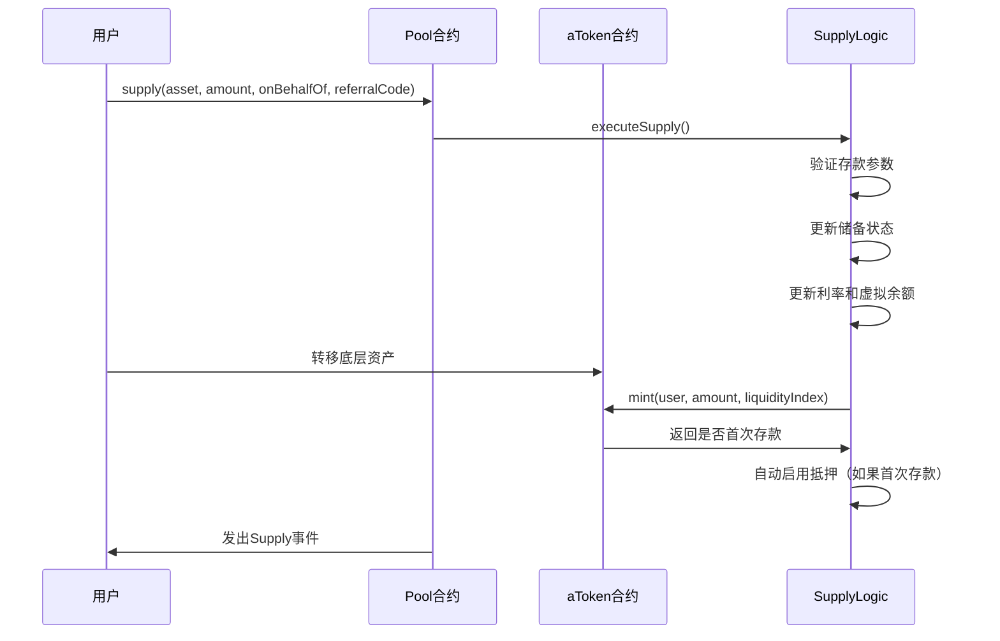
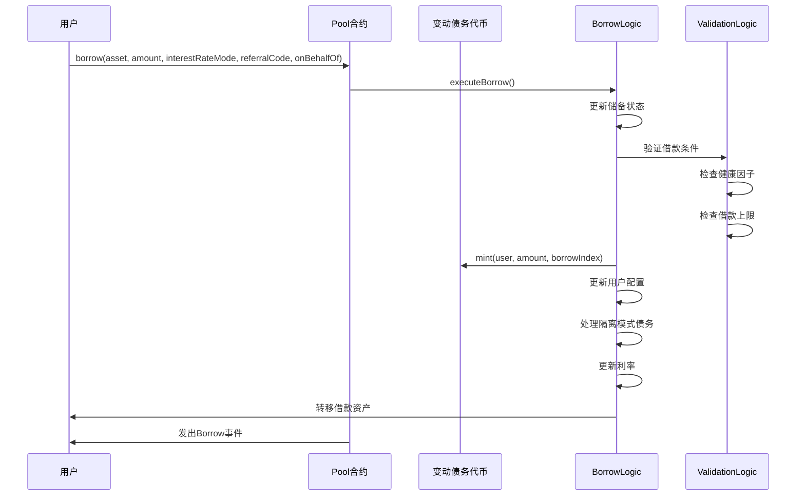
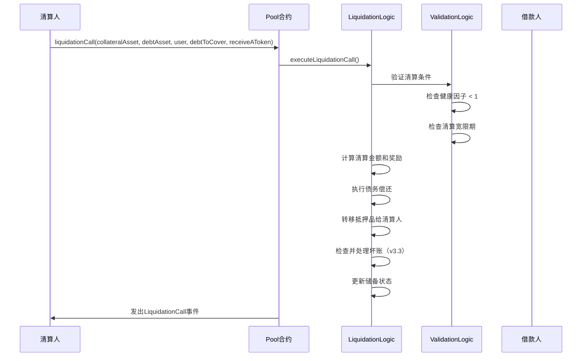
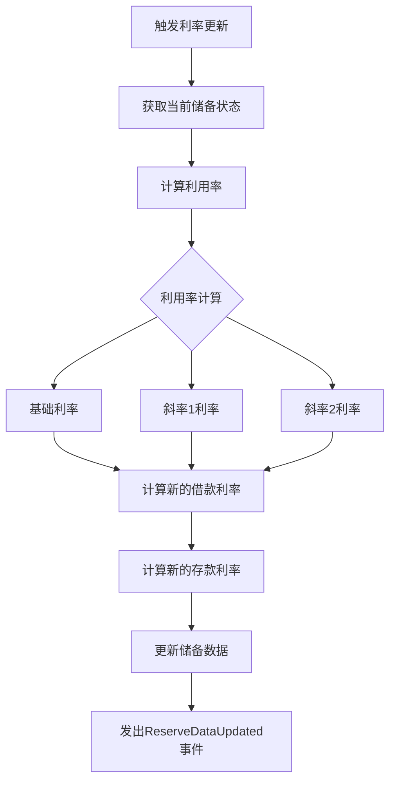

# Aave V3 协议学习文档

## 目录
1. [项目概述](#项目概述)
2. [核心架构](#核心架构)
3. [关键概念](#关键概念)
4. [核心组件](#核心组件)
5. [核心流程](#核心流程)
6. [版本演进](#版本演进)
7. [安全机制](#安全机制)
8. [集成指南](#集成指南)
9. [学习资源](#学习资源)

## 项目概述

Aave V3 是一个去中心化的非托管流动性协议，用户可以：
- 作为供应商或借款人参与
- 供应商向协议提供流动性以赚取被动收入
- 借款人能够以超额抵押（永久）或不足额抵押（一次性流动性）的方式借款

### 核心特性
- **跨链功能**：支持多个区块链网络
- **资本效率**：通过隔离模式和效率模式（eMode）提高资本效率
- **风险管理**：先进的风险参数和清算机制
- **可扩展性**：模块化架构支持新功能添加

## 核心架构

### 智能合约架构图



### 主要合约说明

| 合约名称 | 作用 | 关键功能 |
|---------|------|----------|
| **Pool** | 核心合约 | 供应、借款、还款、清算、闪电贷 |
| **PoolConfigurator** | 配置管理 | 储备配置、风险参数设置 |
| **PoolAddressesProvider** | 地址注册表 | 管理所有合约地址 |
| **aToken** | 存款凭证 | 代表用户在协议中的存款 |
| **VariableDebtToken** | 债务代币 | 代表用户的变动利率债务 |

## 关键概念

### 1. 储备（Reserve）
每个支持的资产在协议中都被视为一个储备，包含：
- **流动性指数**：累积的存款利息
- **变动借款指数**：累积的借款利息
- **利率**：当前的存款和借款利率
- **配置参数**：LTV、清算阈值、清算奖励等

### 2. 健康因子（Health Factor）
```
健康因子 = (抵押品价值 × 清算阈值) / 总债务价值
```
- HF > 1：安全状态
- HF < 1：可被清算

### 3. 效率模式（eMode）
- 允许同类资产间的高杠杆借贷
- 例如：ETH相关资产间可达95% LTV

### 4. 隔离模式（Isolation Mode）
- 限制特定资产的借款行为
- 提供额外的风险控制

## 核心组件

### Pool合约核心功能

```solidity
interface IPool {
    // 存款
    function supply(address asset, uint256 amount, address onBehalfOf, uint16 referralCode) external;
    
    // 提取
    function withdraw(address asset, uint256 amount, address to) external returns (uint256);
    
    // 借款
    function borrow(address asset, uint256 amount, uint256 interestRateMode, uint16 referralCode, address onBehalfOf) external;
    
    // 还款
    function repay(address asset, uint256 amount, uint256 interestRateMode, address onBehalfOf) external returns (uint256);
    
    // 清算
    function liquidationCall(address collateralAsset, address debtAsset, address user, uint256 debtToCover, bool receiveAToken) external;
    
    // 闪电贷
    function flashLoan(address receiverAddress, address[] calldata assets, uint256[] calldata amounts, uint256[] calldata modes, address onBehalfOf, bytes calldata params, uint16 referralCode) external;
}
```

### 数据结构

```solidity
struct ReserveData {
    ReserveConfigurationMap configuration;  // 储备配置
    uint128 liquidityIndex;                 // 流动性指数
    uint128 currentLiquidityRate;           // 当前流动性利率
    uint128 variableBorrowIndex;            // 变动借款指数
    uint128 currentVariableBorrowRate;      // 当前变动借款利率
    uint128 deficit;                        // v3.3新增：赤字
    uint40 lastUpdateTimestamp;             // 最后更新时间戳
    uint16 id;                              // 储备ID
    uint40 liquidationGracePeriodUntil;     // 清算宽限期
    address aTokenAddress;                  // aToken地址
    address variableDebtTokenAddress;       // 变动债务代币地址
    uint128 accruedToTreasury;             // 累积到金库的金额
    uint128 virtualUnderlyingBalance;       // 虚拟底层余额
    uint128 isolationModeTotalDebt;        // 隔离模式总债务
}
```

## 核心流程

### 1. 存款流程



### 2. 借款流程



### 3. 清算流程



### 4. 利率更新机制



## 版本演进

### V3.1 主要特性
1. **虚拟账户系统**：防止资产捐赠攻击
2. **状态化利率策略**：简化利率管理
3. **紧急管理员冻结权限**：增强安全性
4. **最小小数位要求**：提高精度安全性

### V3.2 主要特性
1. **弃用固定利率模式**：移除复杂的固定利率借贷
2. **流动性eMode**：改进效率模式

### V3.3 主要特性
1. **坏账管理**：自动处理坏账情况
2. **清算逻辑改进**：
   - 50%关闭因子重新设计
   - 基于位置大小的100%关闭因子
   - 强制位置清理
3. **位图访问优化**：减少gas消耗
4. **额外获取器函数**：更好的集成支持

### V3.4 主要特性
1. **移除自定义GHO**：简化架构
2. **多调用支持**：批量操作
3. **位置管理器**：代理管理功能

## 安全机制

### 1. 价格预言机安全
- 多源价格聚合
- 价格偏差检测
- 预言机哨兵机制

### 2. 清算保护
- 健康因子监控
- 清算宽限期
- 清算奖励机制

### 3. 资金安全
- 时间锁机制
- 多重签名管理
- 紧急暂停功能

### 4. 智能合约安全
- 形式化验证
- 多轮安全审计
- 漏洞赏金计划

## 集成指南

### 基本集成示例

```solidity
pragma solidity ^0.8.0;

import {IPool} from "@aave/core-v3/contracts/interfaces/IPool.sol";
import {IPoolAddressesProvider} from "@aave/core-v3/contracts/interfaces/IPoolAddressesProvider.sol";

contract AaveIntegration {
    IPoolAddressesProvider public immutable ADDRESSES_PROVIDER;
    IPool public immutable POOL;

    constructor(address addressesProvider) {
        ADDRESSES_PROVIDER = IPoolAddressesProvider(addressesProvider);
        POOL = IPool(ADDRESSES_PROVIDER.getPool());
    }

    function supply(address asset, uint256 amount) external {
        IERC20(asset).transferFrom(msg.sender, address(this), amount);
        IERC20(asset).approve(address(POOL), amount);
        POOL.supply(asset, amount, msg.sender, 0);
    }

    function withdraw(address asset, uint256 amount) external {
        POOL.withdraw(asset, amount, msg.sender);
    }

    function borrow(address asset, uint256 amount) external {
        POOL.borrow(asset, amount, 2, 0, msg.sender);
    }

    function repay(address asset, uint256 amount) external {
        IERC20(asset).transferFrom(msg.sender, address(this), amount);
        IERC20(asset).approve(address(POOL), amount);
        POOL.repay(asset, amount, 2, msg.sender);
    }
}
```

### 重要集成注意事项

1. **利率模式**：在v3.2+中，只使用变动利率模式（interestRateMode = 2）
2. **事件监听**：监听关键事件以跟踪状态变化
3. **健康因子监控**：持续监控以避免清算
4. **Gas优化**：使用批量操作减少gas消耗

## 学习资源

### 官方文档
- [Aave V3 技术白皮书](./docs/Aave_V3_Technical_Paper.pdf)
- [V3.1 特性文档](./docs/3.1/Aave-v3.1-features.md)
- [V3.2 特性文档](./docs/3.2/Aave-3.2-features.md)
- [V3.3 特性文档](./docs/3.3/Aave-v3.3-features.md)

### 安全审计报告
- Certora 形式化验证
- OpenZeppelin 安全审计
- Trail of Bits 安全审计
- PeckShield 安全审计
- SigmaPrime 安全审计

### 开发资源
- [GitHub 仓库](https://github.com/aave-dao/aave-v3-origin)
- [开发者文档](https://docs.aave.com/developers/)
- [API 参考](https://docs.aave.com/developers/core-contracts/pool)

### 社区资源
- [Aave 治理论坛](https://governance.aave.com/)
- [Discord 社区](https://discord.gg/aave)
- [Twitter](https://twitter.com/aave)

## 总结

Aave V3 是一个高度优化的去中心化借贷协议，具备：

1. **模块化架构**：易于维护和升级
2. **先进的风险管理**：多层安全机制
3. **资本效率**：隔离模式和效率模式
4. **跨链兼容性**：支持多个区块链网络
5. **持续演进**：定期更新和优化

对于开发者而言，理解其核心架构、流程和安全机制是成功集成的关键。建议从基本的存款/借款功能开始，逐步深入更复杂的特性如清算和闪电贷。