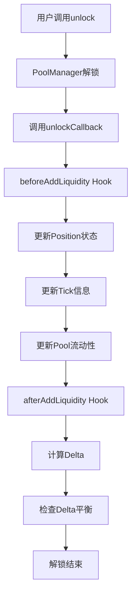
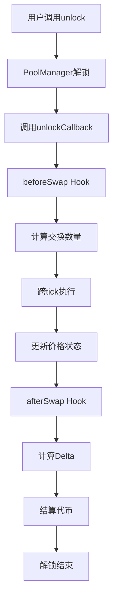

# Uniswap V4 核心学习文档

## 目录
1. [项目概述](#项目概述)
2. [核心架构](#核心架构)
3. [主要组件详解](#主要组件详解)
4. [核心流程分析](#核心流程分析)
5. [Hook系统详解](#hook系统详解)
6. [关键数据结构](#关键数据结构)
7. [代码示例与使用](#代码示例与使用)
8. [安全性考虑](#安全性考虑)
9. [学习路径建议](#学习路径建议)

## 项目概述

### 什么是Uniswap V4？

Uniswap V4是下一代自动化做市商(AMM)协议，提供可扩展和可定制的流动性池。相比V3，V4最大的创新在于：

- **Singleton架构**：所有池状态由单一的`PoolManager`合约管理
- **Hook系统**：允许开发者在池操作的各个生命周期节点插入自定义逻辑
- **解锁-回调模式**：更灵活的交易执行模式
- **降低Gas成本**：通过架构优化显著降低交易成本

### 与V3的主要区别

| 特性 | V3 | V4 |
|------|----|----|
| 架构 | 每个池独立合约 | Singleton架构 |
| 可扩展性 | 固定逻辑 | Hook系统 |
| Gas成本 | 较高 | 优化降低 |
| 集成复杂度 | 中等 | 更灵活但需理解更多概念 |

## 核心架构

### Singleton模式

V4采用单例模式，所有池状态都存储在一个`PoolManager`合约中：

```
┌─────────────────────────────────────┐
│            PoolManager              │
│  ┌─────────────────────────────────┐ │
│  │         Pool State 1            │ │
│  │         Pool State 2            │ │
│  │         Pool State N            │ │
│  └─────────────────────────────────┘ │
│                                     │
│  ┌─────────────────────────────────┐ │
│  │       Hook Management           │ │
│  │       Fee Management            │ │
│  │       Delta Management          │ │
│  └─────────────────────────────────┘ │
└─────────────────────────────────────┘
```

### 解锁-回调模式

V4引入了独特的解锁-回调执行模式：

```
1. 用户调用 unlock() 
2. PoolManager 进入解锁状态
3. 回调用户的 unlockCallback()
4. 用户在回调中执行池操作
5. 检查delta平衡
6. 解锁结束
```

## 主要组件详解

### 1. PoolManager.sol - 核心管理器

`PoolManager`是V4的核心合约，负责：

- 池的初始化和状态管理
- 流动性操作（添加/移除）
- 交换操作
- Hook调用管理
- Delta余额追踪

**关键方法**：
- `initialize()`: 初始化新池
- `swap()`: 执行代币交换
- `modifyLiquidity()`: 修改流动性位置
- `unlock()`: 进入解锁状态

### 2. Pool.sol - 池状态库

Pool库包含池的核心状态和操作逻辑：

```solidity
struct State {
    Slot0 slot0;                    // 价格、tick等核心状态
    uint256 feeGrowthGlobal0X128;   // 全局手续费增长
    uint256 feeGrowthGlobal1X128;
    uint128 liquidity;              // 当前流动性
    mapping(int24 => TickInfo) ticks;
    mapping(int16 => uint256) tickBitmap;
    mapping(bytes32 => Position.State) positions;
}
```

### 3. Hooks.sol - 钩子系统

Hook系统是V4的最大创新，允许在以下时机插入自定义逻辑：

- `beforeInitialize` / `afterInitialize`
- `beforeAddLiquidity` / `afterAddLiquidity`
- `beforeRemoveLiquidity` / `afterRemoveLiquidity`
- `beforeSwap` / `afterSwap`
- `beforeDonate` / `afterDonate`

### 4. PoolKey - 池标识符

```solidity
struct PoolKey {
    Currency currency0;    // 第一个代币
    Currency currency1;    // 第二个代币
    uint24 fee;           // 手续费
    int24 tickSpacing;    // tick间距
    IHooks hooks;         // 钩子合约
}
```

## 核心流程分析

### 流动性添加流程



### 交换执行流程



### Delta管理系统

Delta系统追踪每个用户在unlock期间的净余额变化：

```
Delta = 用户应收金额 - 用户应付金额
正值：PoolManager欠用户
负值：用户欠PoolManager
```

## Hook系统详解

### Hook地址编码

Hook的功能通过其部署地址的最低14位确定：

```
地址: 0x0000000000000000000000000000000000002400
二进制: 10 0100 0000 0000
对应Hook: beforeInitialize + afterAddLiquidity
```

### Hook标志位

```solidity
uint160 internal constant BEFORE_INITIALIZE_FLAG = 1 << 13;
uint160 internal constant AFTER_INITIALIZE_FLAG = 1 << 12;
uint160 internal constant BEFORE_ADD_LIQUIDITY_FLAG = 1 << 11;
uint160 internal constant AFTER_ADD_LIQUIDITY_FLAG = 1 << 10;
// ... 其他标志位
```

### 自定义Hook示例

```solidity
contract MyHook is BaseHook {
    constructor(IPoolManager _poolManager) BaseHook(_poolManager) {}
    
    function beforeSwap(
        address sender,
        PoolKey calldata key,
        SwapParams calldata params,
        bytes calldata hookData
    ) external override returns (bytes4, BeforeSwapDelta, uint24) {
        // 自定义逻辑：动态调整手续费
        uint24 newFee = calculateDynamicFee(key, params);
        return (BaseHook.beforeSwap.selector, BeforeSwapDeltaLibrary.ZERO_DELTA, newFee);
    }
}
```

## 关键数据结构

### Slot0 - 核心状态

```solidity
struct Slot0 {
    uint160 sqrtPriceX96;    // 当前价格的平方根
    int24 tick;              // 当前tick
    uint24 protocolFee;      // 协议手续费
    uint24 lpFee;           // 流动性提供者手续费
}
```

### BalanceDelta - 余额变化

```solidity
struct BalanceDelta {
    int128 amount0;  // 代币0的变化量
    int128 amount1;  // 代币1的变化量
}
```

### Position - 流动性头寸

```solidity
struct State {
    uint128 liquidity;                    // 流动性数量
    uint256 feeGrowthInside0LastX128;    // 内部手续费增长
    uint256 feeGrowthInside1LastX128;
}
```

## 代码示例与使用

### 基本交换示例

```solidity
contract SwapExample is IUnlockCallback {
    IPoolManager public immutable poolManager;
    
    constructor(IPoolManager _poolManager) {
        poolManager = _poolManager;
    }
    
    function swap(
        PoolKey memory key,
        SwapParams memory params
    ) external {
        poolManager.unlock(abi.encode(key, params));
    }
    
    function unlockCallback(bytes calldata data) external returns (bytes memory) {
        require(msg.sender == address(poolManager));
        
        (PoolKey memory key, SwapParams memory params) = 
            abi.decode(data, (PoolKey, SwapParams));
            
        BalanceDelta delta = poolManager.swap(key, params, "");
        
        // 处理代币转账
        if (delta.amount0() > 0) {
            IERC20(Currency.unwrap(key.currency0)).transfer(
                address(poolManager), uint256(uint128(delta.amount0()))
            );
        }
        
        return "";
    }
}
```

### 流动性提供示例

```solidity
contract LiquidityExample is IUnlockCallback {
    function addLiquidity(
        PoolKey memory key,
        ModifyLiquidityParams memory params
    ) external {
        poolManager.unlock(abi.encode(key, params, true));
    }
    
    function unlockCallback(bytes calldata data) external returns (bytes memory) {
        (PoolKey memory key, ModifyLiquidityParams memory params, bool isAdd) = 
            abi.decode(data, (PoolKey, ModifyLiquidityParams, bool));
            
        (BalanceDelta delta, BalanceDelta feesAccrued) = 
            poolManager.modifyLiquidity(key, params, "");
            
        // 处理代币转账和手续费
        settleLiquidity(key, delta, feesAccrued);
        
        return "";
    }
}
```

## 安全性考虑

### 1. 重入攻击防护
- 使用Lock机制防止重入
- 严格的delta检查确保余额平衡

### 2. Hook安全性
- Hook地址验证
- 回调返回值检查
- Gas限制和超时保护

### 3. 精度和溢出
- 使用SafeCast防止溢出
- 固定点数学库确保精度

### 4. 权限控制
- 只有授权地址可以调用特定函数
- Hook权限通过地址编码验证

## 学习路径建议

### 初级阶段
1. **理解AMM基础概念**
   - 流动性、滑点、无常损失
   - tick、price、sqrtPrice关系

2. **熟悉V4基本架构**
   - Singleton模式
   - unlock-callback模式
   - 基本数据结构

### 中级阶段
3. **深入理解核心组件**
   - PoolManager详细分析
   - Pool状态管理
   - Delta系统工作原理

4. **学习Hook系统**
   - Hook标志位系统
   - 常见Hook模式
   - 自定义Hook开发

### 高级阶段
5. **复杂应用开发**
   - 多池路由
   - 闪电贷集成
   - 套利机器人

6. **性能优化**
   - Gas优化技巧
   - 批量操作
   - 状态访问模式

### 实践项目建议

1. **简单交换器**：实现基本的代币交换功能
2. **流动性管理器**：添加/移除流动性的界面
3. **动态费率Hook**：根据波动性调整手续费
4. **套利机器人**：跨池套利策略
5. **收益聚合器**：自动复投手续费收益

## 资源链接

- [官方仓库](https://github.com/Uniswap/v4-core)
- [官方文档](https://docs.uniswap.org/protocol/V4/overview)
- [V4白皮书](https://github.com/Uniswap/v4-core/blob/main/docs/whitepaper/whitepaper-v4.pdf)
- [示例代码](https://github.com/Uniswap/v4-periphery)
- [Hook示例](https://github.com/Uniswap/v4-template)

## 总结

Uniswap V4通过Singleton架构和Hook系统，为DeFi生态系统带来了前所未有的灵活性和可扩展性。虽然学习曲线较陡峭，但其强大的功能和优化的性能使其成为下一代AMM协议的标杆。

掌握V4需要深入理解其核心概念、仔细研究代码实现，并通过实际项目来巩固学习成果。建议按照上述学习路径循序渐进，从基础概念开始，逐步深入到高级应用开发。