# Uniswap V4 核心流程图

本文档包含Uniswap V4各个核心操作的详细流程图，帮助开发者理解系统的工作原理。

## 目录
1. [系统架构概览](#系统架构概览)
2. [池初始化流程](#池初始化流程)
3. [流动性操作流程](#流动性操作流程)
4. [交换执行流程](#交换执行流程)
5. [Hook系统执行流程](#hook系统执行流程)
6. [Delta管理流程](#delta管理流程)
7. [安全检查流程](#安全检查流程)

## 系统架构概览

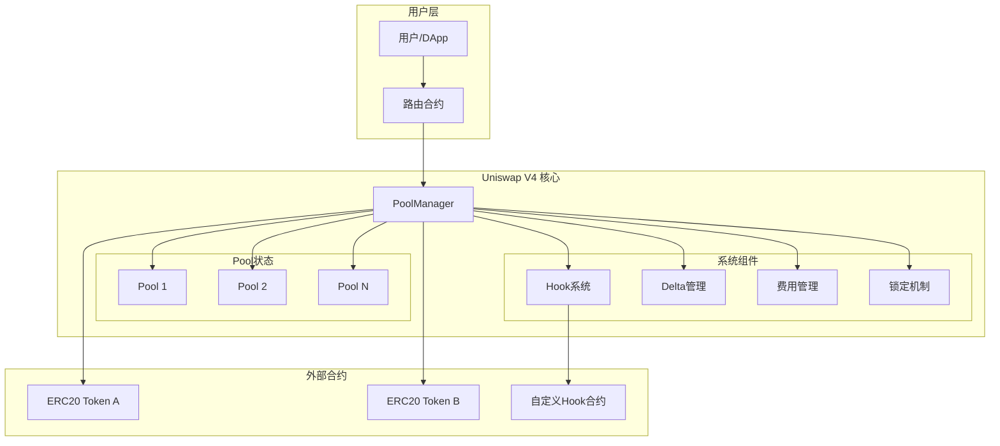

## 池初始化流程

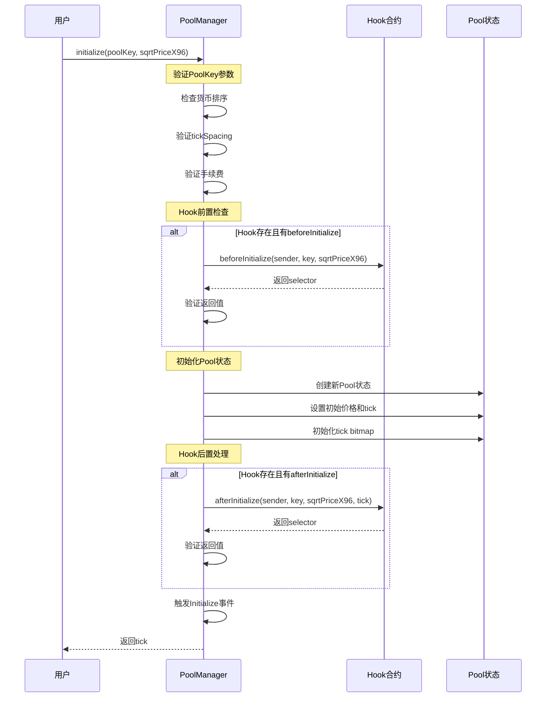

## 流动性操作流程

### 添加流动性

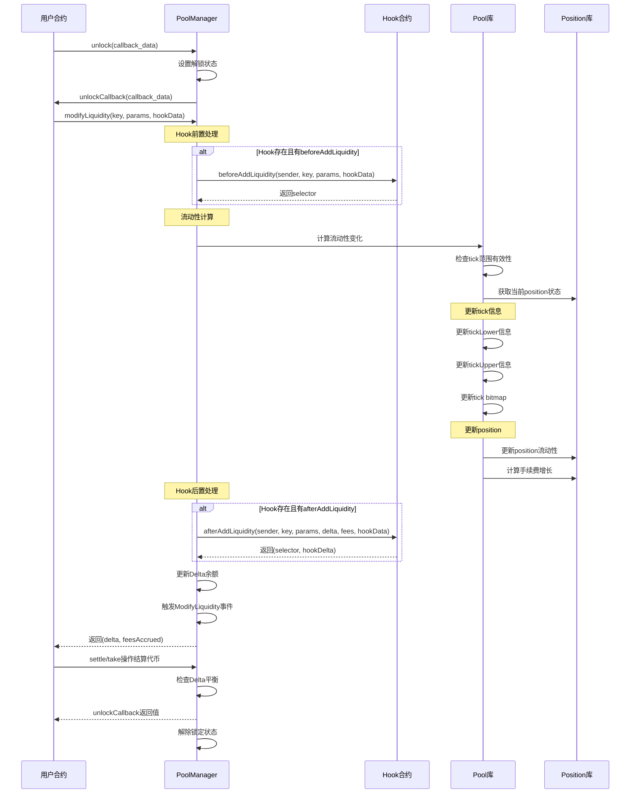

### 移除流动性

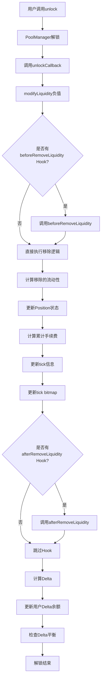

## 交换执行流程

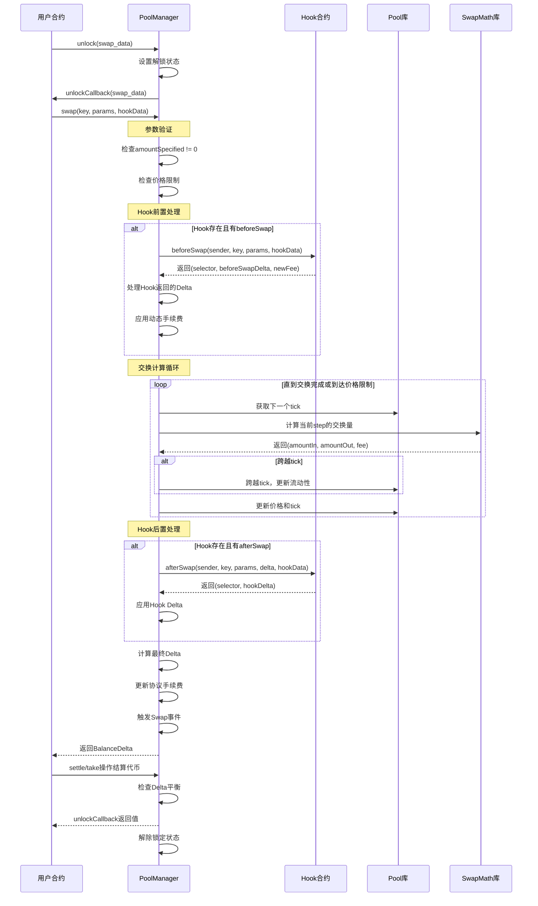

### 交换详细计算流程

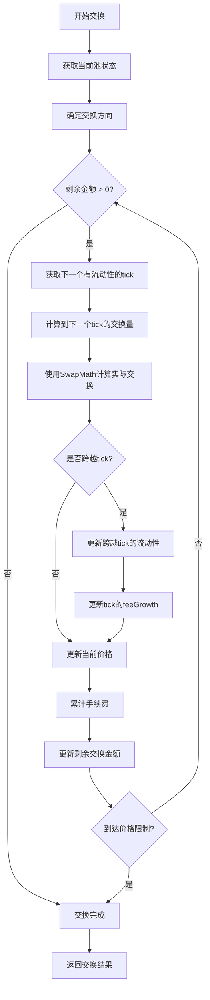

## Hook系统执行流程

### Hook权限验证流程

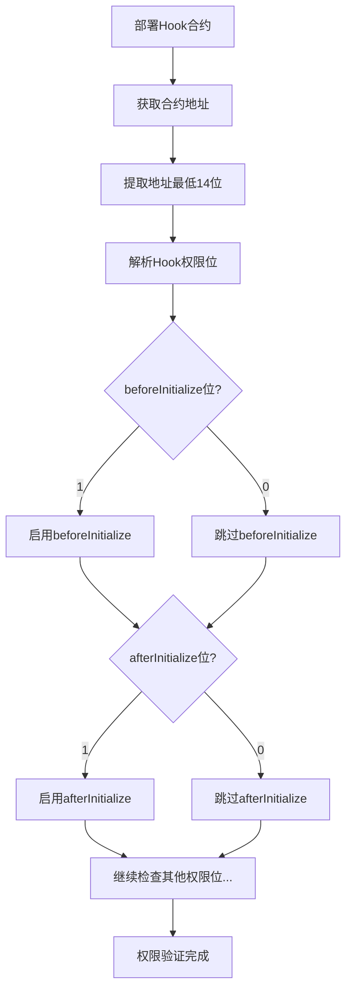

### Hook调用流程

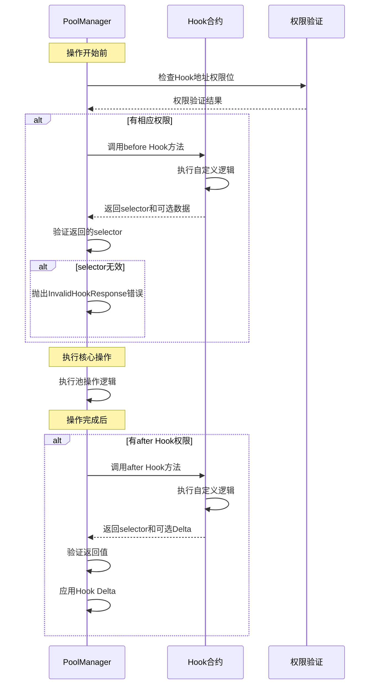

## Delta管理流程

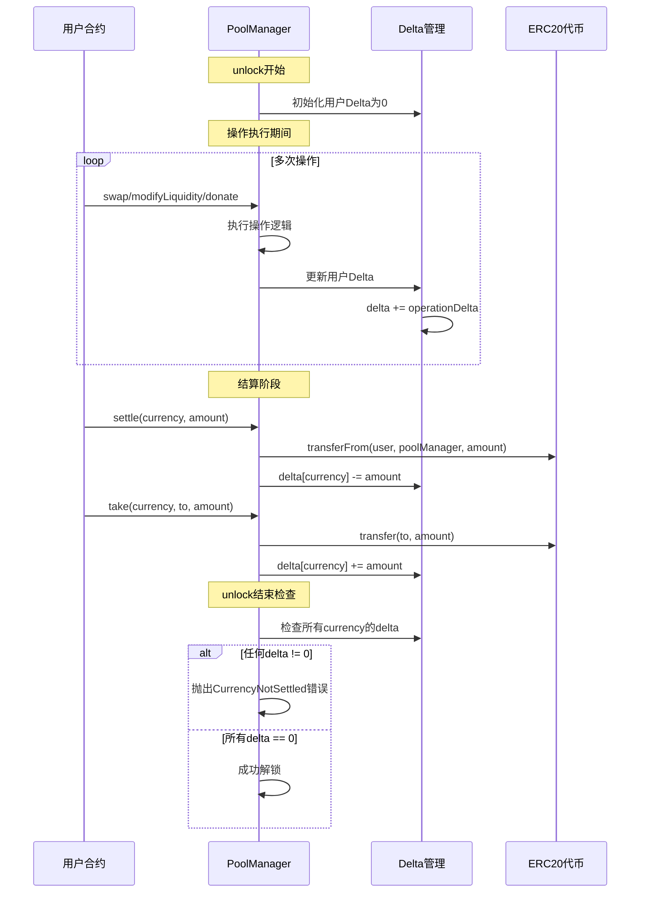

### Delta计算详细流程

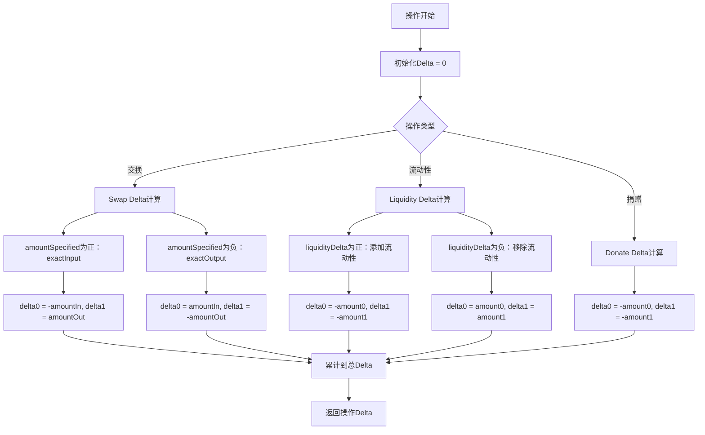

## 安全检查流程

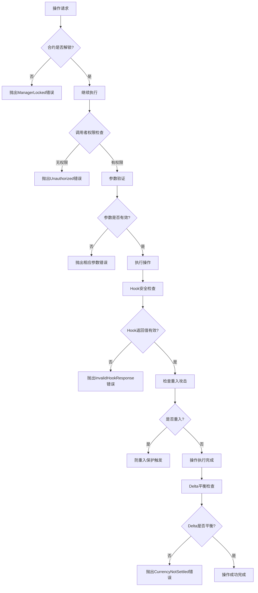

### 重入攻击防护机制

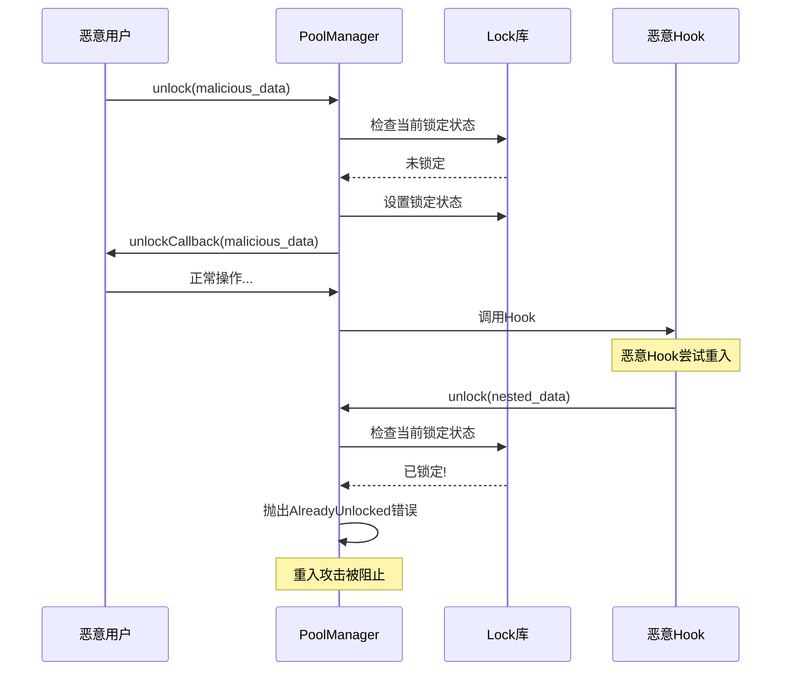

## 总结

这些流程图展示了Uniswap V4的核心工作机制：

1. **Singleton架构**通过统一的PoolManager管理所有池状态
2. **Hook系统**在操作的关键节点提供扩展能力
3. **Delta管理**确保操作的原子性和一致性
4. **安全机制**防止重入攻击和确保参数有效性

理解这些流程有助于：
- 开发自定义Hook合约
- 集成V4到现有DeFi应用
- 优化Gas使用和操作效率
- 确保合约安全性

建议结合源代码和测试用例来深入理解每个流程的具体实现细节。