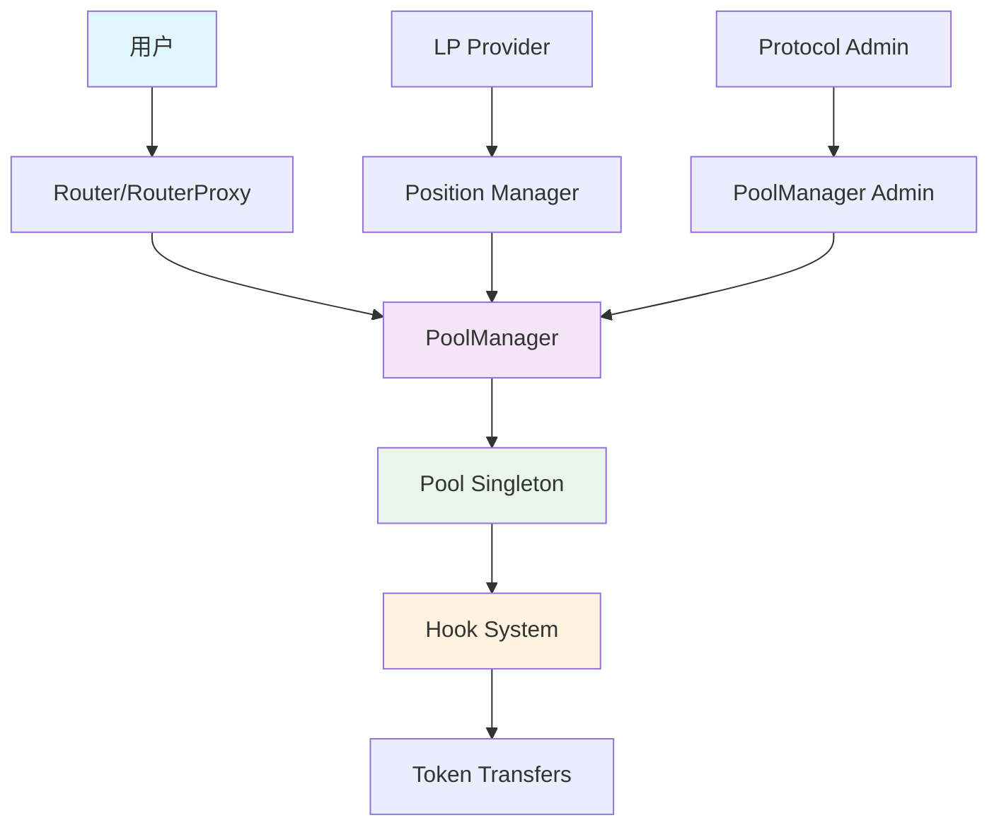
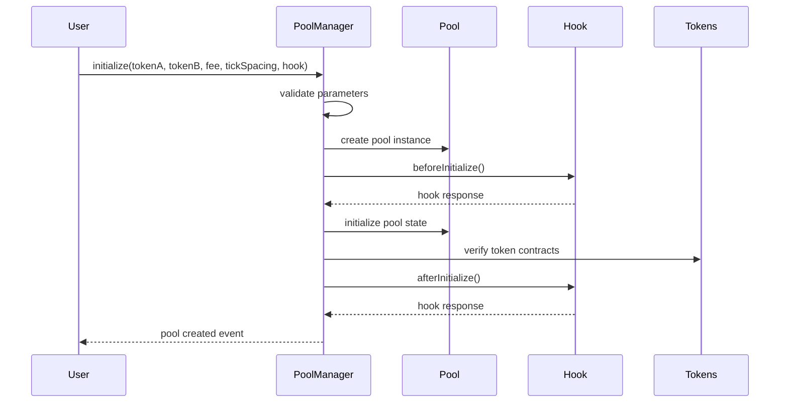
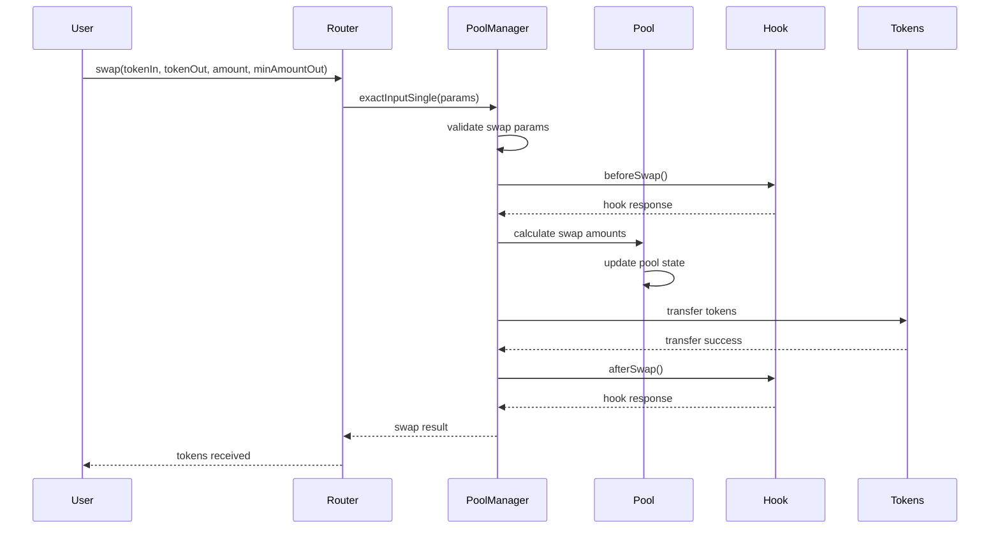
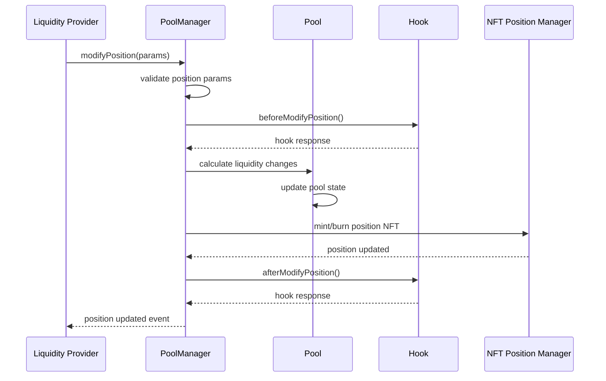
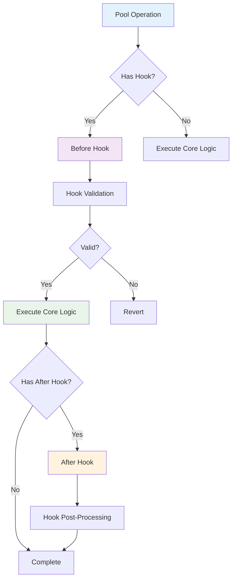
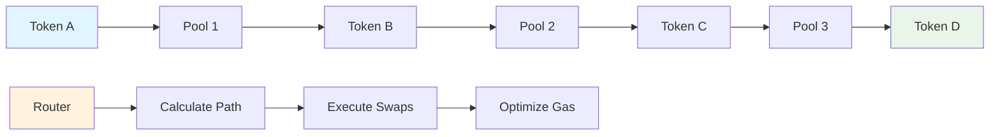
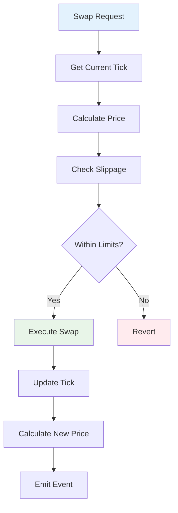
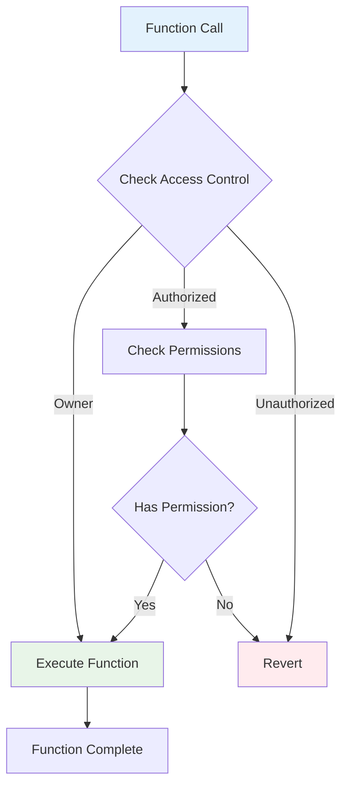
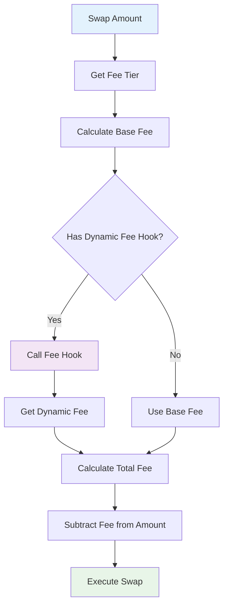
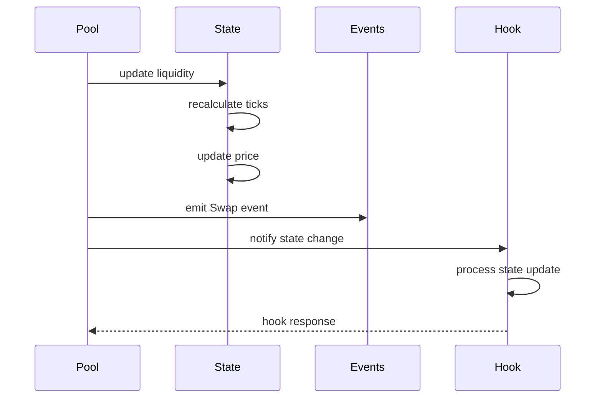

# Uniswap V4 核心流程图

## 🔄 系统整体流程图



## 🏊 池子创建流程



## 💱 交易执行流程



## 💧 流动性管理流程



## 🎣 Hook 系统执行流程



## 🔄 多跳交易流程



## 🎯 价格计算流程



## 🔐 权限控制流程



## 💰 费用计算流程



## 🔄 状态更新流程



## 📊 关键数据流

### 池子状态数据结构
```
Pool State:
├── token0, token1
├── fee, tickSpacing
├── liquidity
├── sqrtPriceX96
├── tick
├── protocolFees
└── hook fees
```

### 交易参数结构
```
Swap Params:
├── tokenIn, tokenOut
├── fee
├── recipient
├── deadline
├── amountIn
├── amountOutMinimum
└── sqrtPriceLimitX96
```

### Hook 回调参数
```
Hook Callback:
├── sender
├── recipient
├── token0, token1
├── fee
├── amount0, amount1
├── sqrtPriceX96
└── liquidity
```