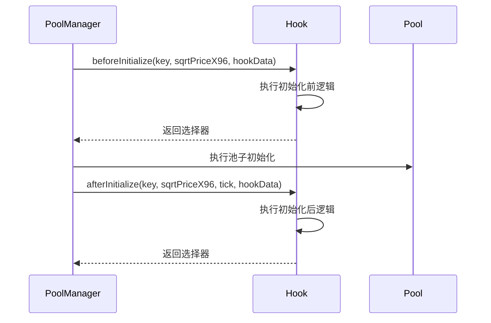
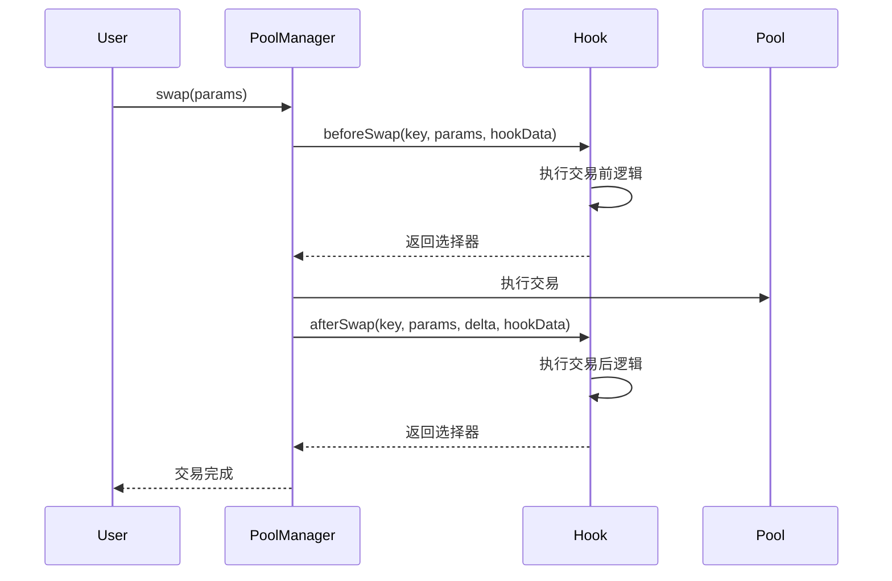
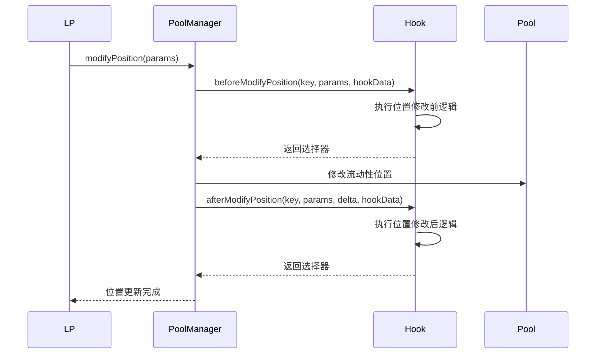

# Uniswap V4 Hook 系统详解

## 🎣 Hook 系统概述

Hook 系统是 Uniswap V4 的核心创新之一，它允许开发者在池子操作的前后执行自定义逻辑，实现了前所未有的可编程性和扩展性。

## 🔧 Hook 接口定义

### 核心接口

```solidity
interface IHooks {
    function beforeInitialize(
        address hookAddress,
        PoolKey calldata key,
        uint160 sqrtPriceX96,
        bytes calldata hookData
    ) external returns (bytes4);

    function afterInitialize(
        address hookAddress,
        PoolKey calldata key,
        uint160 sqrtPriceX96,
        int24 tick,
        bytes calldata hookData
    ) external returns (bytes4);

    function beforeModifyPosition(
        address hookAddress,
        PoolKey calldata key,
        IPoolManager.ModifyPositionParams calldata params,
        bytes calldata hookData
    ) external returns (bytes4);

    function afterModifyPosition(
        address hookAddress,
        PoolKey calldata key,
        IPoolManager.ModifyPositionParams calldata params,
        BalanceDelta delta,
        bytes calldata hookData
    ) external returns (bytes4);

    function beforeSwap(
        address hookAddress,
        PoolKey calldata key,
        IPoolManager.SwapParams calldata params,
        bytes calldata hookData
    ) external returns (bytes4);

    function afterSwap(
        address hookAddress,
        PoolKey calldata key,
        IPoolManager.SwapParams calldata params,
        BalanceDelta delta,
        bytes calldata hookData
    ) external returns (bytes4);
}
```

### 返回值说明

所有 Hook 函数必须返回 `IHooks.beforeInitialize.selector` 等对应的选择器，这确保了 Hook 合约正确实现了接口。

## 🏗️ Hook 执行流程

### 1. 池子初始化 Hook



### 2. 交易 Hook



### 3. 流动性管理 Hook



## 🎯 常见 Hook 类型

### 1. 动态费用 Hook

```solidity
contract DynamicFeeHook {
    mapping(address => uint24) public dynamicFees;
    
    function beforeSwap(
        address hookAddress,
        PoolKey calldata key,
        IPoolManager.SwapParams calldata params,
        bytes calldata hookData
    ) external returns (bytes4) {
        // 根据市场条件计算动态费用
        uint24 dynamicFee = calculateDynamicFee(params);
        dynamicFees[hookAddress] = dynamicFee;
        
        return IHooks.beforeSwap.selector;
    }
    
    function calculateDynamicFee(IPoolManager.SwapParams calldata params) internal view returns (uint24) {
        // 实现动态费用计算逻辑
        // 可以基于交易量、价格波动、时间等因素
        return baseFee + volatilityAdjustment;
    }
}
```

### 2. 限价单 Hook

```solidity
contract LimitOrderHook {
    struct LimitOrder {
        address user;
        bool isBuy;
        uint256 amount;
        uint160 priceLimit;
        uint256 deadline;
    }
    
    mapping(bytes32 => LimitOrder) public limitOrders;
    
    function beforeSwap(
        address hookAddress,
        PoolKey calldata key,
        IPoolManager.SwapParams calldata params,
        bytes calldata hookData
    ) external returns (bytes4) {
        // 检查是否满足限价单条件
        LimitOrder memory order = abi.decode(hookData, (LimitOrder));
        
        require(block.timestamp <= order.deadline, "Order expired");
        require(
            (order.isBuy && params.sqrtPriceLimitX96 <= order.priceLimit) ||
            (!order.isBuy && params.sqrtPriceLimitX96 >= order.priceLimit),
            "Price not met"
        );
        
        return IHooks.beforeSwap.selector;
    }
}
```

### 3. TWAP Hook

```solidity
contract TWAPHook {
    struct TWAPObservation {
        uint32 blockTimestamp;
        uint160 sqrtPriceX96;
        bool initialized;
    }
    
    mapping(address => TWAPObservation) public observations;
    
    function afterSwap(
        address hookAddress,
        PoolKey calldata key,
        IPoolManager.SwapParams calldata params,
        BalanceDelta delta,
        bytes calldata hookData
    ) external returns (bytes4) {
        // 更新 TWAP 观察值
        TWAPObservation storage obs = observations[hookAddress];
        obs.blockTimestamp = uint32(block.timestamp);
        obs.sqrtPriceX96 = getCurrentSqrtPriceX96();
        obs.initialized = true;
        
        return IHooks.afterSwap.selector;
    }
    
    function getTWAP(address pool, uint32 period) external view returns (uint160) {
        // 计算时间加权平均价格
        TWAPObservation memory obs = observations[pool];
        require(obs.initialized, "No observation");
        
        uint32 timeElapsed = block.timestamp - obs.blockTimestamp;
        require(timeElapsed >= period, "Period not elapsed");
        
        return obs.sqrtPriceX96;
    }
}
```

### 4. MEV 保护 Hook

```solidity
contract MEVProtectionHook {
    mapping(address => uint256) public lastBlockNumber;
    
    function beforeSwap(
        address hookAddress,
        PoolKey calldata key,
        IPoolManager.SwapParams calldata params,
        bytes calldata hookData
    ) external returns (bytes4) {
        // 防止同一区块内的 MEV 攻击
        require(
            lastBlockNumber[params.recipient] != block.number,
            "MEV protection: same block"
        );
        
        lastBlockNumber[params.recipient] = block.number;
        
        return IHooks.beforeSwap.selector;
    }
}
```

## 🔐 Hook 安全考虑

### 1. 重入攻击防护

```solidity
contract SafeHook {
    bool private _locked;
    
    modifier nonReentrant() {
        require(!_locked, "Reentrant call");
        _locked = true;
        _;
        _locked = false;
    }
    
    function beforeSwap(
        address hookAddress,
        PoolKey calldata key,
        IPoolManager.SwapParams calldata params,
        bytes calldata hookData
    ) external nonReentrant returns (bytes4) {
        // Hook 逻辑
        return IHooks.beforeSwap.selector;
    }
}
```

### 2. 权限控制

```solidity
contract AccessControlHook {
    address public owner;
    mapping(address => bool) public authorized;
    
    modifier onlyAuthorized() {
        require(authorized[msg.sender] || msg.sender == owner, "Not authorized");
        _;
    }
    
    function beforeSwap(
        address hookAddress,
        PoolKey calldata key,
        IPoolManager.SwapParams calldata params,
        bytes calldata hookData
    ) external onlyAuthorized returns (bytes4) {
        // Hook 逻辑
        return IHooks.beforeSwap.selector;
    }
}
```

### 3. Gas 限制

```solidity
contract GasOptimizedHook {
    uint256 public constant MAX_GAS = 100000;
    
    function beforeSwap(
        address hookAddress,
        PoolKey calldata key,
        IPoolManager.SwapParams calldata params,
        bytes calldata hookData
    ) external returns (bytes4) {
        uint256 gasStart = gasleft();
        
        // Hook 逻辑
        
        require(gasStart - gasleft() <= MAX_GAS, "Gas limit exceeded");
        return IHooks.beforeSwap.selector;
    }
}
```

## 🚀 Hook 开发最佳实践

### 1. 模块化设计

```solidity
contract ModularHook {
    // 将不同功能分离到不同的模块
    DynamicFeeModule public feeModule;
    LimitOrderModule public orderModule;
    TWAPModule public twapModule;
    
    constructor(
        address _feeModule,
        address _orderModule,
        address _twapModule
    ) {
        feeModule = DynamicFeeModule(_feeModule);
        orderModule = LimitOrderModule(_orderModule);
        twapModule = TWAPModule(_twapModule);
    }
    
    function beforeSwap(
        address hookAddress,
        PoolKey calldata key,
        IPoolManager.SwapParams calldata params,
        bytes calldata hookData
    ) external returns (bytes4) {
        // 调用相应的模块
        feeModule.processFee(params);
        orderModule.checkOrders(params);
        twapModule.updateObservation(hookAddress);
        
        return IHooks.beforeSwap.selector;
    }
}
```

### 2. 事件记录

```solidity
contract EventfulHook {
    event HookExecuted(
        address indexed hookAddress,
        bytes4 indexed selector,
        bytes hookData
    );
    
    function beforeSwap(
        address hookAddress,
        PoolKey calldata key,
        IPoolManager.SwapParams calldata params,
        bytes calldata hookData
    ) external returns (bytes4) {
        // Hook 逻辑
        
        emit HookExecuted(hookAddress, IHooks.beforeSwap.selector, hookData);
        return IHooks.beforeSwap.selector;
    }
}
```

### 3. 升级机制

```solidity
contract UpgradeableHook {
    address public implementation;
    address public admin;
    
    modifier onlyAdmin() {
        require(msg.sender == admin, "Not admin");
        _;
    }
    
    function upgrade(address newImplementation) external onlyAdmin {
        implementation = newImplementation;
    }
    
    fallback() external {
        address impl = implementation;
        assembly {
            calldatacopy(0, 0, calldatasize())
            let result := delegatecall(gas(), impl, 0, calldatasize(), 0, 0)
            returndatacopy(0, 0, returndatasize())
            switch result
            case 0 { revert(0, returndatasize()) }
            default { return(0, returndatasize()) }
        }
    }
}
```

## 📊 Hook 性能优化

### 1. 缓存机制

```solidity
contract CachedHook {
    mapping(bytes32 => uint256) public cache;
    
    function beforeSwap(
        address hookAddress,
        PoolKey calldata key,
        IPoolManager.SwapParams calldata params,
        bytes calldata hookData
    ) external returns (bytes4) {
        bytes32 cacheKey = keccak256(abi.encodePacked(hookAddress, params.amountIn));
        
        // 检查缓存
        if (cache[cacheKey] != 0) {
            // 使用缓存值
            return IHooks.beforeSwap.selector;
        }
        
        // 计算新值并缓存
        uint256 result = expensiveCalculation(params);
        cache[cacheKey] = result;
        
        return IHooks.beforeSwap.selector;
    }
}
```

### 2. 批量处理

```solidity
contract BatchHook {
    function beforeSwap(
        address hookAddress,
        PoolKey calldata key,
        IPoolManager.SwapParams calldata params,
        bytes calldata hookData
    ) external returns (bytes4) {
        // 批量处理多个操作
        address[] memory tokens = abi.decode(hookData, (address[]));
        
        for (uint i = 0; i < tokens.length; i++) {
            processToken(tokens[i]);
        }
        
        return IHooks.beforeSwap.selector;
    }
}
```

## 🔮 Hook 生态系统

### 1. Hook 市场

- **标准化 Hook**: 通用的 Hook 实现
- **定制 Hook**: 针对特定需求的 Hook
- **Hook 组合**: 多个 Hook 的组合使用

### 2. 开发工具

- **Hook 模板**: 快速开发 Hook 的模板
- **测试框架**: Hook 测试工具
- **部署工具**: 简化的 Hook 部署流程

### 3. 社区贡献

- **开源 Hook**: 社区贡献的 Hook 实现
- **文档和教程**: Hook 开发指南
- **最佳实践**: 社区总结的开发经验