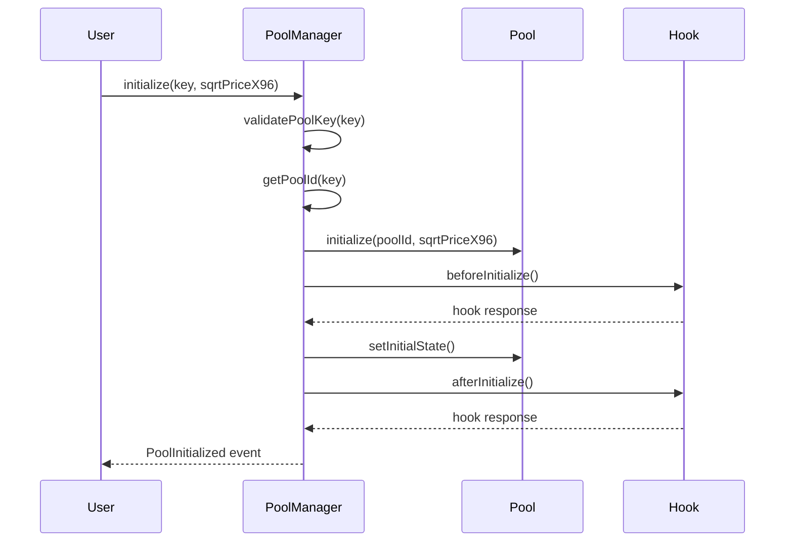

# Uniswap V4 单例池管理详解

## 🏗️ 单例池架构概述

Uniswap V4 的单例池设计是协议的重大创新，所有池子共享同一个合约地址，通过不同的参数组合来区分不同的池子。

## 🔑 池子标识机制

### PoolKey 结构

```solidity
struct PoolKey {
    Currency currency0;    // 第一个代币
    Currency currency1;    // 第二个代币
    uint24 fee;           // 费用等级
    int24 tickSpacing;    // tick 间距
    IHooks hooks;         // Hook 合约地址
}
```

### 池子地址计算

```solidity
function getPoolId(PoolKey memory key) internal pure returns (PoolId) {
    return PoolId.wrap(keccak256(abi.encode(key)));
}

function getPool(PoolKey memory key) internal view returns (Pool) {
    return pools[getPoolId(key)];
}
```

## 📊 单例池数据结构

### 池子状态管理

```solidity
contract Pool {
    // 池子标识
    PoolId public immutable poolId;
    
    // 池子状态
    Slot0 public slot0;
    
    // 流动性信息
    mapping(int24 => Info) public ticks;
    
    // 位置信息
    mapping(bytes32 => Position.Info) public positions;
    
    struct Slot0 {
        uint160 sqrtPriceX96;  // 当前价格的平方根
        int24 tick;           // 当前 tick
        uint16 protocolFee;   // 协议费用
        uint24 swapFee;       // 交换费用
        bool unlocked;        // 锁定状态
    }
    
    struct Info {
        uint128 liquidityGross;    // 总流动性
        int128 liquidityNet;       // 净流动性
        uint256 feeGrowthOutside0X128;  // 外部费用增长
        uint256 feeGrowthOutside1X128;
        uint56 secondsPerLiquidityOutsideX128;
        uint32 secondsOutside;
        bool initialized;
    }
}
```

## 🔄 池子生命周期管理

### 1. 池子创建流程



### 2. 池子状态更新

```solidity
contract PoolManager {
    mapping(PoolId => Pool) public pools;
    
    function initialize(
        PoolKey memory key,
        uint160 sqrtPriceX96,
        bytes calldata hookData
    ) external returns (PoolId poolId) {
        poolId = getPoolId(key);
        
        // 检查池子是否已存在
        require(pools[poolId] == address(0), "Pool already exists");
        
        // 创建新池子
        Pool pool = new Pool(poolId);
        pools[poolId] = pool;
        
        // 初始化池子
        pool.initialize(sqrtPriceX96);
        
        // 调用 Hook
        if (key.hooks != address(0)) {
            key.hooks.beforeInitialize(address(this), key, sqrtPriceX96, hookData);
            key.hooks.afterInitialize(address(this), key, sqrtPriceX96, pool.tick(), hookData);
        }
        
        emit PoolInitialized(poolId, key.currency0, key.currency1, key.fee, key.tickSpacing, key.hooks);
    }
}
```

## 💰 费用管理

### 费用结构

```solidity
struct FeeConfig {
    uint24 swapFee;        // 交换费用
    uint16 protocolFee;    // 协议费用
    uint24 hookFee;        // Hook 费用
}

contract Pool {
    FeeConfig public feeConfig;
    
    function setFeeConfig(FeeConfig memory config) external onlyOwner {
        require(config.swapFee <= MAX_FEE, "Fee too high");
        require(config.protocolFee <= MAX_PROTOCOL_FEE, "Protocol fee too high");
        
        feeConfig = config;
        emit FeeConfigUpdated(config);
    }
    
    function calculateFees(uint256 amount) internal view returns (
        uint256 swapFee,
        uint256 protocolFee,
        uint256 hookFee
    ) {
        swapFee = (amount * feeConfig.swapFee) / FEE_DENOMINATOR;
        protocolFee = (amount * feeConfig.protocolFee) / FEE_DENOMINATOR;
        hookFee = (amount * feeConfig.hookFee) / FEE_DENOMINATOR;
    }
}
```

## 🔄 流动性管理

### 位置管理

```solidity
contract PositionManager {
    struct Position {
        address owner;
        int24 tickLower;
        int24 tickUpper;
        uint128 liquidity;
        uint256 feeGrowthInside0LastX128;
        uint256 feeGrowthInside1LastX128;
        uint128 tokensOwed0;
        uint128 tokensOwed1;
    }
    
    mapping(uint256 => Position) public positions;
    mapping(address => uint256[]) public userPositions;
    
    function mint(
        MintParams calldata params
    ) external returns (uint256 tokenId, uint128 liquidity, uint256 amount0, uint256 amount1) {
        // 创建新位置
        tokenId = _nextTokenId();
        
        Position storage position = positions[tokenId];
        position.owner = params.recipient;
        position.tickLower = params.tickLower;
        position.tickUpper = params.tickUpper;
        
        // 添加流动性
        (liquidity, amount0, amount1) = pool.modifyPosition(
            params.tickLower,
            params.tickUpper,
            params.liquidityDelta
        );
        
        position.liquidity = liquidity;
        
        // 记录用户位置
        userPositions[params.recipient].push(tokenId);
        
        _mint(params.recipient, tokenId);
        
        emit PositionMinted(tokenId, params.recipient, liquidity, amount0, amount1);
    }
}
```

### 流动性计算

```solidity
contract Pool {
    function modifyPosition(
        int24 tickLower,
        int24 tickUpper,
        int256 liquidityDelta
    ) external returns (uint256 amount0, uint256 amount1) {
        // 验证参数
        require(tickLower < tickUpper, "Invalid tick range");
        require(tickLower >= MIN_TICK, "Tick too low");
        require(tickUpper <= MAX_TICK, "Tick too high");
        
        // 更新流动性
        if (liquidityDelta != 0) {
            // 更新下边界
            if (tickLower <= tick) {
                ticks[tickLower].liquidityNet += liquidityDelta;
            }
            
            // 更新上边界
            if (tickUpper > tick) {
                ticks[tickUpper].liquidityNet -= liquidityDelta;
            }
            
            // 更新当前流动性
            if (tickLower <= tick && tick < tickUpper) {
                liquidity += liquidityDelta;
            }
        }
        
        // 计算代币数量
        (amount0, amount1) = calculateAmounts(tickLower, tickUpper, liquidityDelta);
        
        return (amount0, amount1);
    }
}
```

## 🎯 价格管理

### 价格计算

```solidity
contract Pool {
    function getSqrtRatioAtTick(int24 tick) internal pure returns (uint160) {
        require(tick >= MIN_TICK && tick <= MAX_TICK, "Tick out of range");
        
        uint256 absTick = tick < 0 ? uint256(-int256(tick)) : uint256(int256(tick));
        require(absTick <= uint256(uint24(MAX_TICK)), "Tick out of range");
        
        uint256 ratio = absTick & 0x1 != 0 ? 0xfffcb933bd6fad37aa2d162d1a594001 : 0x100000000000000000000000000000000;
        if (absTick & 0x2 != 0) ratio = (ratio * 0xfff97272373d413259a46990580e213a) >> 128;
        if (absTick & 0x4 != 0) ratio = (ratio * 0xfff2e50f5f656932ef12357cf3c7fdcc) >> 128;
        if (absTick & 0x8 != 0) ratio = (ratio * 0xffe5caca7e10e4e61c3624eaa0941cd0) >> 128;
        if (absTick & 0x10 != 0) ratio = (ratio * 0xffcb9843d60f6159c9db58835c926644) >> 128;
        if (absTick & 0x20 != 0) ratio = (ratio * 0xff973b41fa98c081472e6896dfb254c0) >> 128;
        if (absTick & 0x40 != 0) ratio = (ratio * 0xff2ea16466c96a3843ec78b326b52861) >> 128;
        if (absTick & 0x80 != 0) ratio = (ratio * 0xfe5dee046a99a2a811c461f1969c3053) >> 128;
        if (absTick & 0x100 != 0) ratio = (ratio * 0xfcbe86c7900a88aedcffc83b479aa3a4) >> 128;
        if (absTick & 0x200 != 0) ratio = (ratio * 0xf987a7253ac413176f2b074cf7815e54) >> 128;
        if (absTick & 0x400 != 0) ratio = (ratio * 0xf3392b0822b70005940c7a398e4b70f3) >> 128;
        if (absTick & 0x800 != 0) ratio = (ratio * 0xe7159475a2c29b7443b29c7fa6e889d9) >> 128;
        if (absTick & 0x1000 != 0) ratio = (ratio * 0xd097f3bdfd2022b8845ad8f792aa5825) >> 128;
        if (absTick & 0x2000 != 0) ratio = (ratio * 0xa9f746462d870fdf8a65dc1f90e061e5) >> 128;
        if (absTick & 0x4000 != 0) ratio = (ratio * 0x70d869a1562d1a594001) >> 128;
        if (absTick & 0x8000 != 0) ratio = (ratio * 0x31be135f97d08fd981231505542fcfa6) >> 128;
        if (absTick & 0x10000 != 0) ratio = (ratio * 0x9aa508b5b7a84e1c677de54f3e99bc9) >> 128;
        if (absTick & 0x20000 != 0) ratio = (ratio * 0x5d6af8dedb81196699c329225ee604) >> 128;
        if (absTick & 0x40000 != 0) ratio = (ratio * 0x2216e584f5fa1ea926041bedfe98) >> 128;
        if (absTick & 0x80000 != 0) ratio = (ratio * 0x48a170391f7dc42444e8fa2) >> 128;
        
        if (tick > 0) ratio = type(uint256).max / ratio;
        
        return uint160((ratio >> 32) + (ratio % (1 << 32) == 0 ? 0 : 1));
    }
}
```

### 价格更新

```solidity
contract Pool {
    function swap(
        address recipient,
        bool zeroForOne,
        int256 amountSpecified,
        uint160 sqrtPriceLimitX96,
        bytes calldata data
    ) external returns (int256 amount0, int256 amount1) {
        // 获取当前价格
        uint160 sqrtPriceX96 = slot0.sqrtPriceX96;
        
        // 计算新价格
        uint160 sqrtPriceNextX96 = getNextSqrtPriceFromInput(
            sqrtPriceX96,
            liquidity,
            amountSpecified,
            zeroForOne
        );
        
        // 检查价格限制
        if (zeroForOne) {
            require(sqrtPriceNextX96 >= sqrtPriceLimitX96, "Price limit exceeded");
        } else {
            require(sqrtPriceNextX96 <= sqrtPriceLimitX96, "Price limit exceeded");
        }
        
        // 更新价格
        slot0.sqrtPriceX96 = sqrtPriceNextX96;
        slot0.tick = getTickAtSqrtRatio(sqrtPriceNextX96);
        
        // 计算代币数量
        (amount0, amount1) = calculateSwapAmounts(amountSpecified, zeroForOne);
        
        return (amount0, amount1);
    }
}
```

## 🔐 安全机制

### 访问控制

```solidity
contract PoolManager {
    address public owner;
    mapping(address => bool) public authorized;
    
    modifier onlyOwner() {
        require(msg.sender == owner, "Not owner");
        _;
    }
    
    modifier onlyAuthorized() {
        require(authorized[msg.sender] || msg.sender == owner, "Not authorized");
        _;
    }
    
    function setOwner(address newOwner) external onlyOwner {
        owner = newOwner;
        emit OwnerChanged(newOwner);
    }
    
    function setAuthorized(address account, bool status) external onlyOwner {
        authorized[account] = status;
        emit AuthorizationChanged(account, status);
    }
}
```

### 重入保护

```solidity
contract Pool {
    modifier lock() {
        require(slot0.unlocked, "LOK");
        slot0.unlocked = false;
        _;
        slot0.unlocked = true;
    }
    
    function swap(
        address recipient,
        bool zeroForOne,
        int256 amountSpecified,
        uint160 sqrtPriceLimitX96,
        bytes calldata data
    ) external lock returns (int256 amount0, int256 amount1) {
        // 交换逻辑
    }
}
```

## 📊 性能优化

### Gas 优化

```solidity
contract Pool {
    // 使用紧凑的数据结构
    struct CompactSlot0 {
        uint160 sqrtPriceX96;
        int24 tick;
        uint16 protocolFee;
        uint24 swapFee;
        bool unlocked;
    }
    
    // 批量操作
    function batchModifyPosition(
        ModifyPositionParams[] calldata params
    ) external returns (uint256[] memory amounts0, uint256[] memory amounts1) {
        amounts0 = new uint256[](params.length);
        amounts1 = new uint256[](params.length);
        
        for (uint i = 0; i < params.length; i++) {
            (amounts0[i], amounts1[i]) = modifyPosition(
                params[i].tickLower,
                params[i].tickUpper,
                params[i].liquidityDelta
            );
        }
    }
}
```

### 状态压缩

```solidity
contract Pool {
    // 使用位操作压缩状态
    function packSlot0(
        uint160 sqrtPriceX96,
        int24 tick,
        uint16 protocolFee,
        uint24 swapFee,
        bool unlocked
    ) internal pure returns (uint256) {
        return uint256(sqrtPriceX96) |
               (uint256(uint24(tick)) << 160) |
               (uint256(protocolFee) << 184) |
               (uint256(swapFee) << 200) |
               (unlocked ? uint256(1) << 224 : 0);
    }
    
    function unpackSlot0(uint256 packed) internal pure returns (
        uint160 sqrtPriceX96,
        int24 tick,
        uint16 protocolFee,
        uint24 swapFee,
        bool unlocked
    ) {
        sqrtPriceX96 = uint160(packed);
        tick = int24(uint24(packed >> 160));
        protocolFee = uint16(packed >> 184);
        swapFee = uint24(packed >> 200);
        unlocked = (packed >> 224) != 0;
    }
}
```

## 🔮 未来扩展

### 1. 多池子支持

```solidity
contract MultiPoolManager {
    mapping(PoolId => Pool) public pools;
    mapping(address => PoolId[]) public userPools;
    
    function createPool(PoolKey memory key) external returns (PoolId) {
        PoolId poolId = getPoolId(key);
        require(pools[poolId] == address(0), "Pool exists");
        
        Pool pool = new Pool(poolId);
        pools[poolId] = pool;
        
        return poolId;
    }
}
```

### 2. 池子升级

```solidity
contract UpgradeablePool {
    address public implementation;
    address public admin;
    
    function upgrade(address newImplementation) external onlyAdmin {
        implementation = newImplementation;
        emit PoolUpgraded(newImplementation);
    }
    
    fallback() external {
        address impl = implementation;
        assembly {
            calldatacopy(0, 0, calldatasize())
            let result := delegatecall(gas(), impl, 0, calldatasize(), 0, 0)
            returndatacopy(0, 0, returndatasize())
            switch result
            case 0 { revert(0, returndatasize()) }
            default { return(0, returndatasize()) }
        }
    }
}
```

### 3. 跨链池子

```solidity
contract CrossChainPool {
    mapping(uint256 => Pool) public pools; // chainId => Pool
    
    function createCrossChainPool(
        uint256 chainId,
        PoolKey memory key
    ) external returns (PoolId) {
        require(chainId != block.chainid, "Same chain");
        
        PoolId poolId = getPoolId(key);
        Pool pool = new CrossChainPool(poolId, chainId);
        pools[chainId] = pool;
        
        return poolId;
    }
}
```